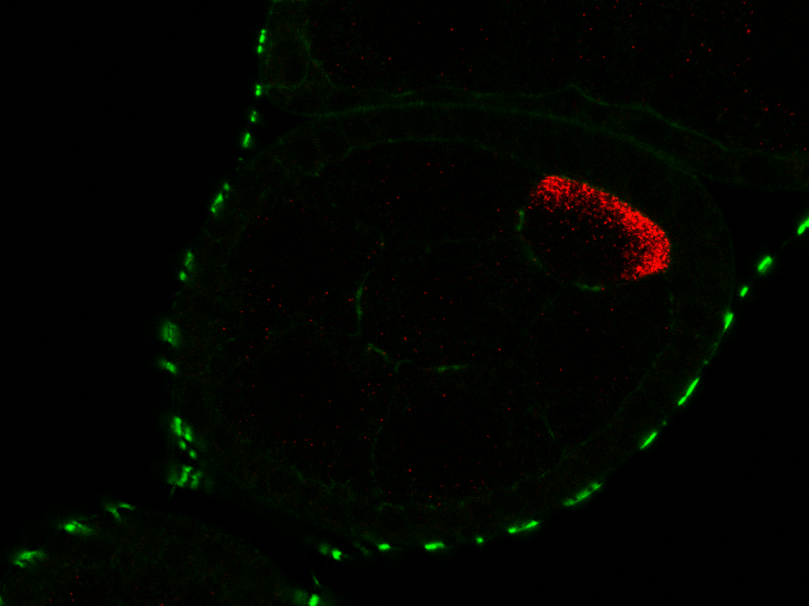

```{r global_options, include=FALSE}
knitr::opts_chunk$set(fig.width=6, fig.height=4,
                      echo=FALSE, warning=FALSE, message=FALSE)
```
Outline of Figures:

Fig1: Drosophila egg chambers exhibit a characteristic network structure of connections between nurse cells A) Cartoon of tissue, B) Equivalent image of tissue, C) Diagram of connections between NCs via RCs.
{ width=30% }
{ width=30% }
{ width=30% }

Fig2: Behaviour of differential equation model. A) Dynamics in time shown for each cell, B) Model related to network structure of nurse cells.
```{r, Fig2, echo=FALSE,message=FALSE}
source('simulate_from_ODE_model.R')
```

Fig3: Assembly of higher order complexes in oocyte A) Particles in different regions of the egg chamber, B) Distribution of intensities of particles in different regions.

```{r, Fig3, echo=FALSE,message=FALSE}
source('estimate_phi_directly.R')
a %>% 
  mutate(Normalised_intensity = BgdSubtract / median(a$MeanByRegion)) %>%
  ggplot(aes(x=Region,y=Normalised_intensity)) +
  geom_violin(draw_quantiles = c(0.5)) +
  geom_jitter(alpha=0.3) +
  labs(y='Normalised intensity') +
  scale_x_discrete("Region", labels = c("background" = "BGD","oocyte" = "OO","nurse_cells" = "NC")) +
  theme_bw()
ggsave('plots/fig3d.eps',device=cairo_ps)
```


Fig4: Characterisation of the bias in directionality of transport through ring canals A) Schematic of transport between two compartments, B) Posterior pairs plot, C) Posterior predictive plot.
{ width=30% }
```{r, Fig4, echo=FALSE,message=FALSE}
source('run_model_comparison_stst.R')
identifier = 'MCv321'
res <- run_model_comparison_stst(identifier=identifier,use_real_data=TRUE,run_mcmc=FALSE,parametersToPlot = c('nu','xi','phi'),verbose=FALSE,show_diagnostic_plots=FALSE,train_on_OE=FALSE)
estimates = readRDS(paste('fits/model_comparison',identifier,'.rds',sep='')) 
library(bayesplot)
library(patchwork)
color_scheme_set("purple")
g2 <- mcmc_dens(as.array(estimates),pars='nu') +
  theme_bw() +
  theme(text = element_text(size = 12), axis.text = element_text(size = 12),
          legend.position = "none", strip.text = element_text(size = 8)) + 
  labs(x=expression(paste('Transport bias  ', nu)),y='Density')
print(g2)
ggsave(paste('plots/fig4_nu_marginal',identifier,'.eps',sep=''),device=cairo_ps)
g1 <- ggplot(data=NULL) + geom_blank() + theme_minimal()
{g1 + g2} - res[[1]] + plot_layout(ncol=1)
ggsave(paste('plots/fig4',identifier,'.eps',sep=''),device=cairo_ps)
```

Fig5: Results of inference for dynamic model A) Posterior pairs plot, B) Posterior predictive distribution, C) Sensitivity to a, b.
```{r, Fig5, echo=FALSE,message=FALSE}
source('mrna_transport_full.R')
res_WT = mrna_transport_inference_full('no_decay_v331',
						use_real_data = TRUE, run_mcmc = TRUE,
						nSamples = 9, nTest = 11, nTestOE = 9,
						verbose = TRUE, compare_via_loo = FALSE,
						show_diagnostic_plots = TRUE, use_hierarchical_model = FALSE,
						use_prior_predictive = FALSE, train_on_OE = FALSE,
						is_nu_uniform = TRUE, no_decay_model = TRUE)
res_OE = mrna_transport_inference_full('no_decay_OE_v332',
						use_real_data = TRUE, run_mcmc = TRUE,
						nSamples = 9, nTest = 11, nTestOE = 9,
						verbose = TRUE, compare_via_loo = FALSE,
						show_diagnostic_plots = TRUE, use_hierarchical_model = FALSE,
						use_prior_predictive = FALSE, train_on_OE = TRUE,
						is_nu_uniform = TRUE, no_decay_model = TRUE)
source('sensitivity_and_analytics.R')
```

Fig6: Validation of testable prediction for over expression versus measured results.  
```{r, Fig6, echo=FALSE}
plot(cars)
```

FigS1: (Supplementary) Exponential growth model to establish timescales A) Schematic of time points used for each stage, B) Linear regression of log(A) against the time points for each stage.
```{r, FigS1, echo=FALSE}
source('extract_times_and_scaling.R')
extract_times_and_scaling(nSamples=15,nTest=5,optional_plot=TRUE)
```

FigS2: Convergence diagnostics for MCMC inference methods
```{r, FigS2, echo=FALSE}
{ width=30% }
{ width=30% }
```
